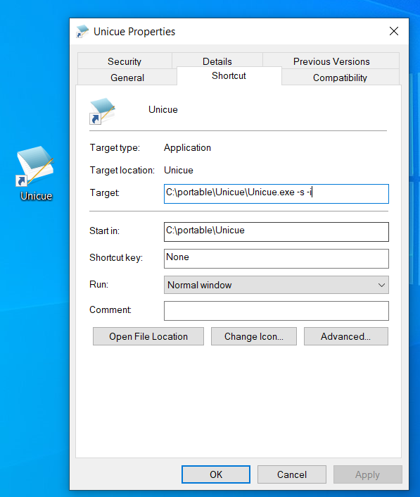
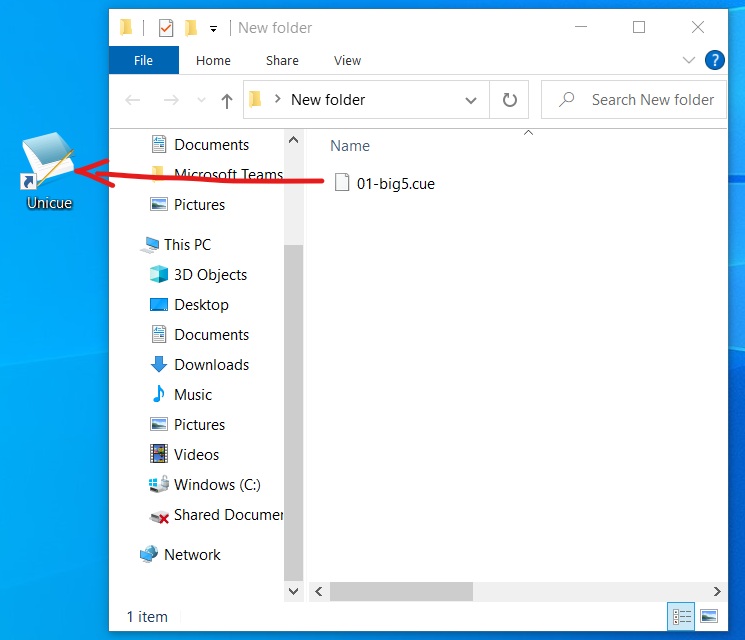
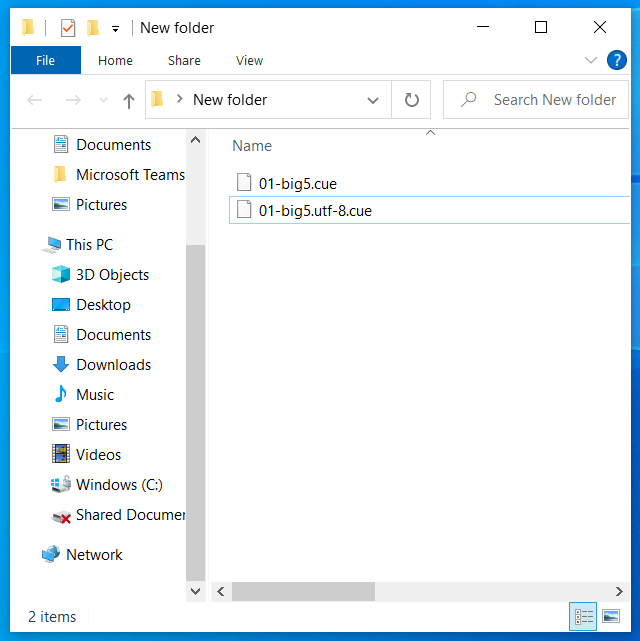

Advanced Usage
=========

Q. I don't want to register any Unicue menu entry into Context Menu. Is there any way that I am still able to to convert a text file silently?

A. Yes, it is possible. Follow the steps below.  
1. Unzip Unicue binary to some folder.

2. Create a shortcut for **Unicue.exe** by sending to desktop.

3. Right click the shortcut on desktop and click **Properties**. 

4. Append ` -s -i` to **Target** and apply. Notice that there is a space between `-s` and `Unicue.exe`. If the path of `Unicue.exe` itself contains space, this part should be quoted by double-quote(`"`) .

5. Drag and drop any text file to the shortcut.  

6. Your text file will be converted silently and stored under the same folder.  

The shortcut is still available for opening GUI interface by double-clicking.